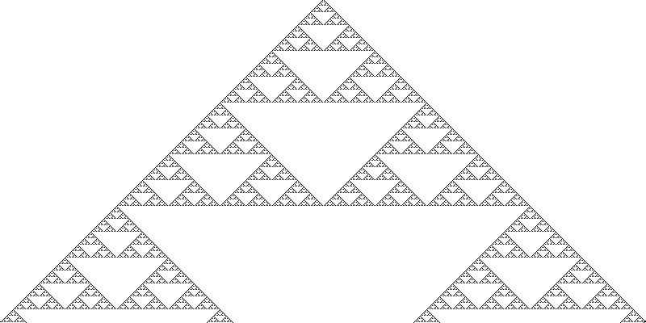
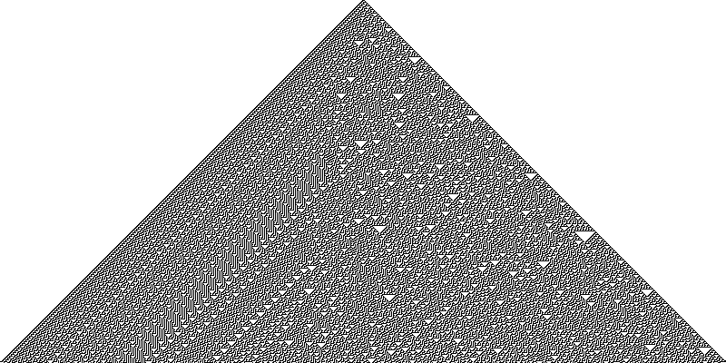
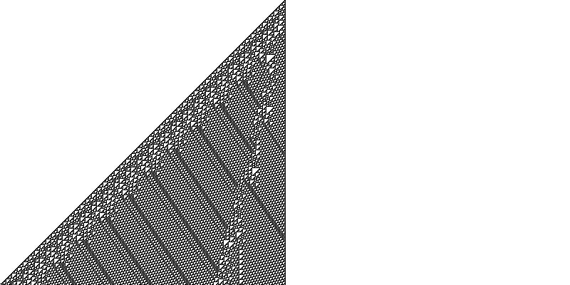
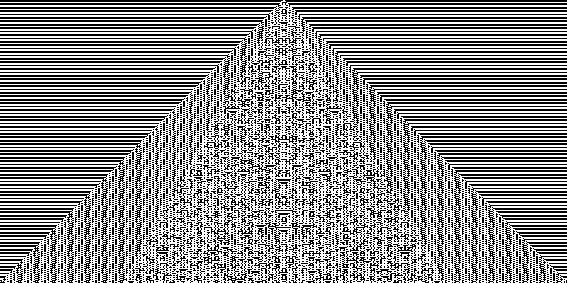

# elementary-cellular-automaton

Elementary Cellular Automaton pattern generator

## Rule 26

## Rule 30

## Rule 57

## Rule 110

## Rule 73

[See more](https://github.com/rickybas/elementary-cellular-automaton/tree/master/images)
